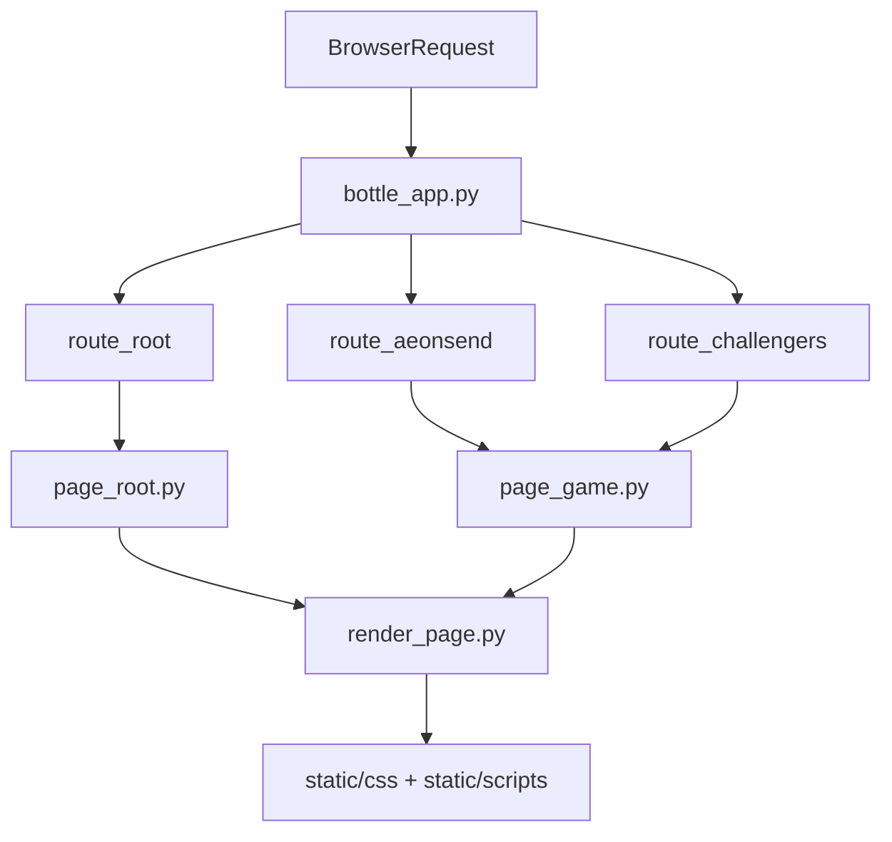

# Setup Express

Bottle web app available at [setupexpress.pythonanywhere.com](https://setupexpress.pythonanywhere.com).

For a chosen game, it generates a random setup, personnalised with the expansions selected by the user.

## Current codebase

The app is intentionally small on the server side:

- `bottle_app.py` defines the Bottle routes and static asset serving.
- `render_page.py` builds the full HTML document and injects the required CSS and JS files.
- `page_root.py` and `page_game.py` generate the page body markup in Python.
- `static/scripts/*.js` contains the browser-side randomizer logic.
- `static/model/*.js` loads and maps JSON data from `static/data/*.json`.

## Request flow

## Supported pages

### Home page

- Route: `/`
- Built by `page_root.py`
- Displays a grid of the games listed in `ALL_GAMES` from `game.py`

### Aeon's End

- Route: `/aeonsend`
- Shared page shell from `page_game.py`
- Client engine in `static/scripts/aeonsend.js`
- Data loader in `static/model/aeonsend_model.js`
- Data source in `static/data/aeonsend_cards.json`

Current behavior:

- Select one or more boxes in the sidebar
- Generate `3` gems, `2` relics, and `4` spells
- Sort selected cards by type and cost
- Reroll one card while preserving its type

### Challengers!

- Route: `/challengers`
- Shared page shell from `page_game.py`
- Client engine in `static/scripts/challengers.js`
- Data loader in `static/model/challengers_model.js`
- Data source in `static/data/challengers_sets.json`

Current behavior:

- Select one or more boxes in the sidebar
- Generate `5` sets
- Reroll one set at a time
- Highlight the source box when hovering a selected result

## Shared frontend behavior

`static/scripts/game_engine.js` contains the common browser logic used by each game page:

- load shared messages from `static/data/messages.json`
- read selected boxes from the sidebar
- build the available item pool
- validate that enough items exist for the requested setup
- render the empty state when nothing is selected
- handle per-item rerolls

## Current scope decisions

- There will be more games in the future (CHALLENGERS is almost ready).
- Need to review the page architecture to separate the sidebar from the main content on small screens
- Create AEONSEND expedition mode
